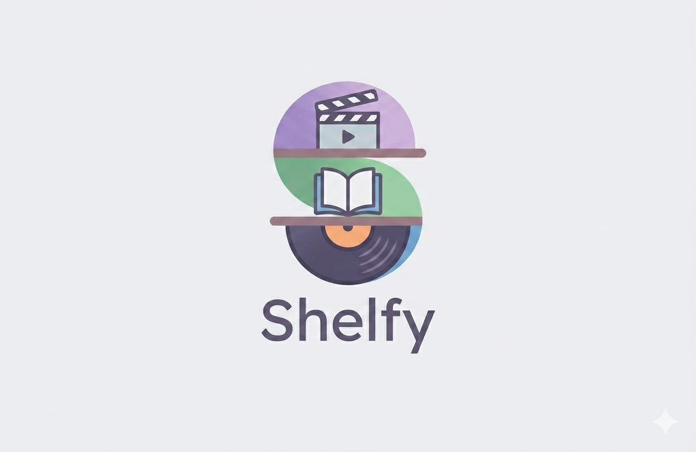

# Shelfy

**Ta collection personnelle de films, livres et vinyles — en un seul endroit.**  
*Your personal collection of movies, books and vinyl records — in one place.*

---

## 🇫🇷 À propos

Shelfy est une application personnelle multi-plateforme conçue pour centraliser et organiser ta collection culturelle.  
Ajoute des films, des livres ou des vinyles depuis de grandes bases de données en ligne, note tes œuvres préférées, gère leurs statuts et retrouve tout depuis n'importe quel appareil grâce à la synchronisation cloud.

L'objectif : ne plus jamais se demander *"Est-ce que je l'ai déjà vu ? lu ? écouté ?"*

## 🇬🇧 About

Shelfy is a personal cross-platform application designed to centralise and organise your cultural collection.  
Add movies, books or vinyl records from major online databases, rate your favourites, manage their status, and access everything from any device through cloud synchronisation.

The goal: never wonder again *"Have I already watched it? read it? listened to it?"*

---

## Tech Stack

---

## ✅ Fonctionnalités actuelles — v1.0.0

### 🎬 Collection & organisation
- Trois types de médias gérés : **films**, **livres**, **vinyles**
- Ajout depuis des bases de données en ligne *(recherche avec résultats instantanés dès la frappe)*
- Ajout rapide en un seul tap depuis les résultats de recherche *(sans ouvrir de formulaire)*
- Statuts par élément *(ex : à voir / vu, à lire / lu, souhaité / possédé)*
- Liste de souhaits dédiée *(les éléments marqués apparaissent automatiquement)*
- Vue bibliothèque globale regroupant toute la collection

### ⭐ Notes
- Système de notation par étoiles *(demi-étoiles, de 0,5 à 5 — affichées /10)*
- Suppression de note en retappant la même valeur *(toggle intuitif)*

### 🔍 Recherche & découverte
- Barre de recherche sur chaque onglet avec debounce *(résultats en temps réel, sans surcharge réseau)*
- Section "Tendances actuelles" sur chaque onglet *(suggestions automatiques depuis les APIs)*
- Filtrage local instantané dans la collection personnelle

### 📄 Page détail
- Vue complète par élément : image, auteur / réalisateur / artiste, année, genre
- Synopsis / résumé / description *(récupérés automatiquement depuis les APIs lors de l'ajout)*
- Bouton "Voir plus" sur les textes longs *(extensible à la demande)*
- Statut et note modifiables directement depuis la page détail *(sans revenir à la liste)*
- Suppression avec confirmation *(action irréversible protégée)*

### 🔐 Authentification & cloud
- Compte utilisateur avec email et mot de passe *(inscription et connexion intégrées)*
- Synchronisation cloud sécurisée *(chaque utilisateur ne voit que ses propres données)*
- Chargement automatique au démarrage si une session existe *(reprise sans action)*
- Cache local *(la collection reste accessible même sans connexion internet)*
- Réinitialisation du mot de passe par lien email *(deep link qui ouvre directement l'app)*

### 🖼️ Photos personnalisées
- Ajout d'une image personnalisée lors de la création manuelle d'un élément
- Trois sources disponibles : **appareil photo**, **photothèque**, **fichiers** *(selon la plateforme)*
- Upload automatique vers le stockage cloud *(image accessible depuis tous les appareils)*

### 🎨 Interface & navigation
- Navigation adaptative *(rail latéral sur desktop, menu sur mobile)*
- Trois thèmes : **Clair**, **Sombre**, **Gris** — persistés entre les sessions *(mémorisés au redémarrage)*
- Transitions fluides entre les onglets *(fondu rapide, sans effet de glissement)*
- Page "À propos & aide" *(description de l'app, fonctionnement détaillé, contact)*

### ⚙️ Paramètres
- Sélecteur de thème *(trois options visuelles)*
- Accès à la page À propos depuis les paramètres
- Version de l'app et copyright affichés en bas de page

---

## 🗺️ Prochaine mise à jour — v1.1

> Les fonctionnalités suivantes sont prévues pour la prochaine version.

- **Thème système automatique** — détection de la préférence claire / sombre du système d'exploitation *(le thème s'adapte sans aucune action manuelle de l'utilisateur)*
- **Nouvel onglet : Jeux** — ajout d'un quatrième type de média pour la gestion des jeux vidéo *(avec statut, note, recherche et API dédiés)*
- **Valeur de la collection** — possibilité de renseigner le prix d'achat d'un objet dans la bibliothèque *(et affichage de la valeur totale estimée de la collection, comparée à la valeur du marché aujourd'hui)*

---

**© 2026 PASCAL Maxime — Tous droits réservés.**  
*Shelfy est une application personnelle. Toute reproduction ou distribution sans autorisation est interdite.*

